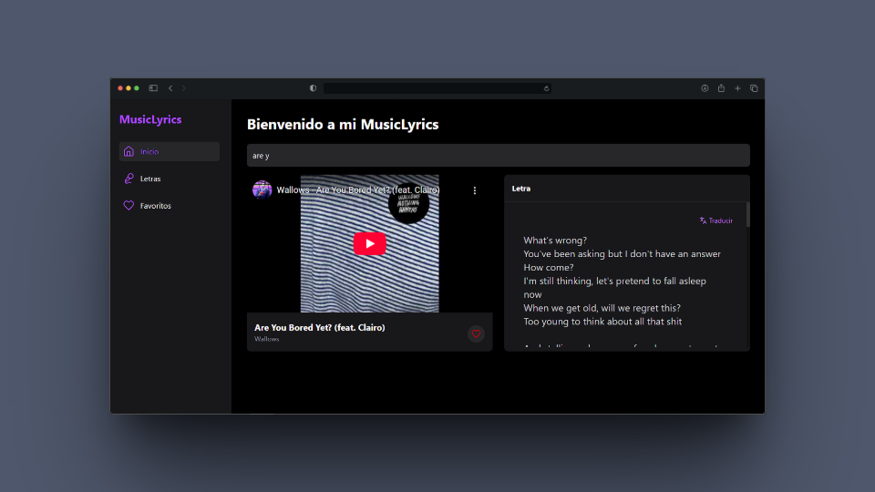

# 🎶 Music-Lyrics

**MusicLyrics** es una aplicación web para explorar y descubrir canciones. Permite buscar temas musicales, ver sus letras, detalles del artista, escuchar una versión en YouTube y marcar tus canciones favoritas.

---

## ✨ Funcionalidades

- 🔎 **Buscar canciones** con sugerencias inteligentes.
- 🎤 **Ver la letra y traducirla** de la canción utilizando la API de Lyrics.ovh.
- 📊 **Detalles** como álbum, géneros, y descripción desde Last.fm.
- 📺 **Reproducción de videos de YouTube** embebidos.
- ❤️ **Marcar canciones como favoritas** (persisten en localStorage).
- ⭐ **Ver todas tus favoritas** en una página dedicada (`FavoritePage`).

---

## 🖼️ Vista previa



---
## 🧱 Tecnologías usadas

- **React**
- **TailwindCSS**
- **Vite**
- **Last.fm API**
- **Lyricsovh API**
- **YouTube Data API v3**
- **localStorage**

---

## 🚀 Instalación local

1. Cloná el repositorio:

```bash
git clone https://github.com/tu-usuario/music-lyrics
cd music-lyrics
